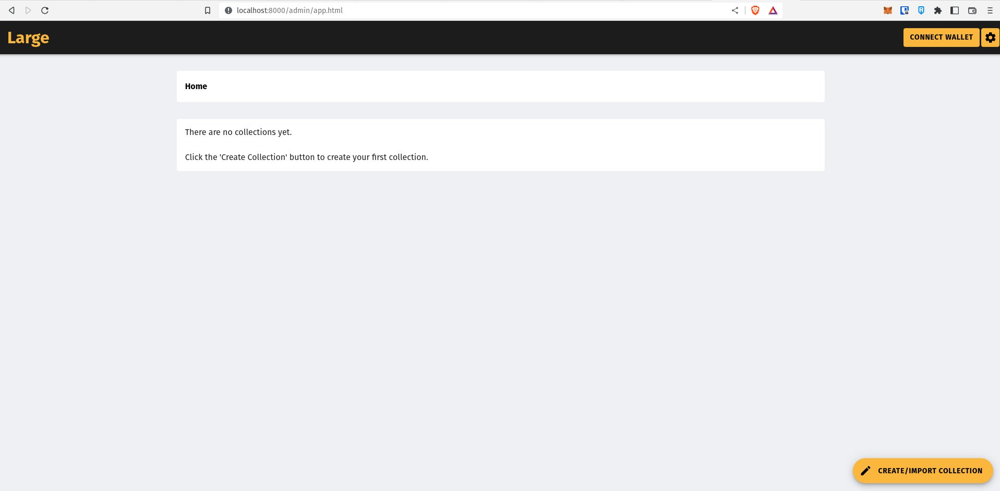

# Large
The easiest way to publish your work as an NFT collection on **Ethereum** and **IPFS**. 

Publish a book, fan-fiction, blog, or art as a forkable NFT collection and sell digital collectibles on marketplaces like LooksRare, OpenSea, and more.

Build a fan site for an existing NFT collection.

Fork any NFT collection to experiment.

Generate a full-featured SEO-friendly PWA built with Framework7 to showcase your book or collection. Native theming for iOS, Android, and Desktop.

Inexpensively scale your community and marketplace on GitHub Pages, GitLab Pages, or any other simple, static webhost. No server compute required. No database server required.

Large stores and replicates NFT data directly in browser storage to help ensure a community can always keep their NFTs online even if the creator (and Large's creators) disappear and takes all of their hardware and software with them. Bitcoin continues to run even though Satoshi disappeared and so should an NFT collection.


## Components

**Large NFT** is a self-hosted web app to help build and publish an NFT collection right in your browser. Create new collections from scratch or fork existing ones. Data is stored right in local browser storage. **Large NFT** can also be whitelabeled and distributed to users. It scales by relying on the user's own hardware instead of cloud servers. So the hardware requirements as your community grows are minimal. 

**Large Reader** is a statically generated, self-hosted PWA that can be deployed to any simple webhost to let users enjoy the collection from any device. Large Reader is optimized for text-based content and has functionality similar to the Kindle. When combined with **Large Sync** it also shows the full transaction history for every token, for every user, and includes a full collection leaderboard. 

**Large Sync** is a simple Node app that generates live Ethereum transaction data for **Large Reader** in real-time or on a schedule. The sync is designed to run both in the browser and in Node. Because it is lightweight it can also be run on a schedule on the free-tier of the popular free webhosts. So users can get the latest data from the webhost or download and process it themselves from their own Ethereum node.

Supports [Alchemy](https://www.alchemy.com/) and local Ethereum nodes. 

Large is alpha software.

## Installation 

### Clone
```console
git clone https://github.com/LargeNFT/large-nft.git
```

### Install dependencies
```console
npm install
```

### Run a local HTTP Server
```console
npm run start
```


# Large NFT

### Access in Browser
Large will be available at [http://localhost:8000](http://localhost:8000) by default.




* Create one or more collections with text, images, and mixed-media NFTs.
* Content is stored in your browser using [PouchDB](https://pouchdb.com).
* Generate NFT metadata and publish to IPFS.
* Generate a reader-style website to view each collection.
* Deploy an ERC-721 gas-optimized smart contract to Ethereum.
* Set a mint price. Keep 100% of fees. 
* List NFTs for sale on OpenSea and other NFT marketplaces. 
* Collection data and website stored in GitHub/GitLab.

The community can easily keep the website online and use it as a starting point for custom fan experiences.

### Create an NFT Collection
Create a collection with the Large admin panel. 

* Choose a name, symbol, description, license, and NFT attributes.
* Create attribute categories.
    * Add attributes to give specific items special properties (eg Type, Hat, Shirt, Necklace)

### Create Content 
* Each item has a title, content, and a cover image.
* If a cover image is not provided an SVG is generated from the text.
* Choose a theme for each item.
* Automatically generates HTML animation for display on marketplaces.

### SVG and HTML Themes
Apply custom CSS formatting to an NFT/item. Create themes and apply them to multiple items. 

### Import and Fork Existing NFT Project
* Instead of starting your project from scratch, import an existing project that was published to IPFS with Large.
* Provide the IPFS hash.
* Remix existing ideas.

---

## Publish to Ethereum, IPFS, and Git

### Export collection metadata to IPFS.
* Connect to browser-based node or configure remote IPFS api.
* NFT metadata, images, animations, and backup data are exported to IPFS.

### Export to GitHub/GitLab
* Create a custom fork of the Large Reader.
* Use personal access token authentication and a CORS proxy to push content directly from your browser to GitHub and GitLab. 

### Deploy contract
* Deploy ERC-721 smart contract with minting capability to Ethereum mainnet or other compatible network.
* Customize smart contract or deploy the default low-gas contract.
    * Based on [ERC721A](https://github.com/chiru-labs/ERC721A)


# Large Reader 
Generate a search-engine friendly static website for each collection. It is also a full-featured PWA (Progressive Web App) with a native look and feel on modern devices.

* Users do not need a web3 browser to read the collection.
* Users do need a web3 browser to mint and interact with NFTs.

Easily read and enjoy content in a familiar interface.


### Offline-first.
* Easily distributed on any static webhost. 
* Simple and customizable HTML/CSS/javascript.
* Wrap with Cordova to distribute to app stores.

### Free and open source. Fork and customize.
* Publish a collection to a public or private repo.
* Includes a full database backup and all associated media. 

### Data lives in browser storage on the user's device.
* Full-text search of collection contents.
* Fork collections directly from the generated **Large Reader** app. 
* This means your community can copy the Large Reader and make their own custom versions easily.
* Easy to build on. Sync your data with commercial scale CouchDB instances. 

### Mint NFTs.
* Minting starts at token #1 and increments.
* Stories are minted in the order they are told.

### Generate Large Reader without deploying a smart contract.
* It's not required to deploy a contract if you do not want to mint NFTs.


The following commands are to be used in the forked repository that you publish from the Large Admin. After pushing the content to your git provider, clone the repo and run the following commands.

### Generate reader for localhost
```console
npm run generate:dev
```

### Generate reader for production
```console
npm run generate
```


# Large Sync

### Start Large Sync
```console
npm run sync
```

### Start local HTTP server
```console
npm run sync --  --env dev --alchemy <API key>
```

**CLI parameters**

--env 

Valid options are "dev" or "production". Default is "production". This loads either the dev or production settings for hostname and baseURL. 

--alchemy 

Pass a valid API key to connect the sync process to a hosted Ethereum node. 

Note: The first -- in the example is mandatory.


### Access in Browser
Your Large Reader will be available at [http://localhost:8081](http://localhost:8081) by default.


# Large Reader Showcase
These project(s) showcase the basic features of the Large Reader. These projects are CC0 licensed and can be forked to start your own version of the project.
* [Alice's Adventures in Wonderland](https://readalice.com)

# CORS

## Enable CORS to publish to IPFS
To publish to a hosted IPFS node:

1. Set the Remote IPFS API url in the Large Admin settings.
    * http://localhost:5001/api/v0 for local.
2. Configure the local node to set the proper CORS headers. Otherwise the browser will block any requests.

```console
ipfs config --json API.HTTPHeaders.Access-Control-Allow-Origin '["*"]'
ipfs config --json API.HTTPHeaders.Access-Control-Allow-Methods '["GET", "POST", "PUT", "OPTIONS"]'
```

## Install CORS Proxy to publish to GitHub/GitLab
Large publishes directly to your git provider from browser storage. By default both GitHub and GitLab make this difficult because of their CORS setup. To get around this please install and use the [CORS Proxy](https://github.com/isomorphic-git/cors-proxy). You configure the URL on the Large NFT settings page.

