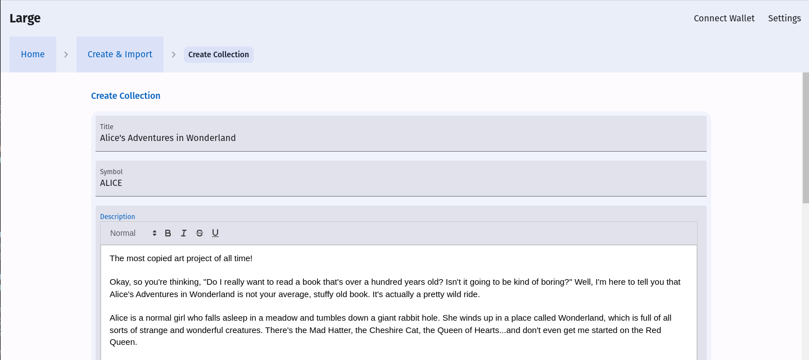
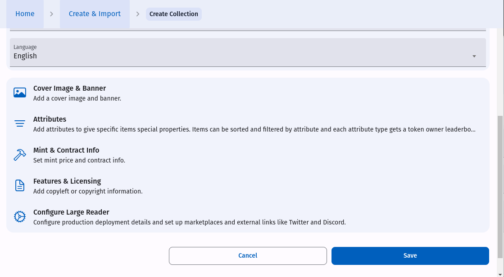
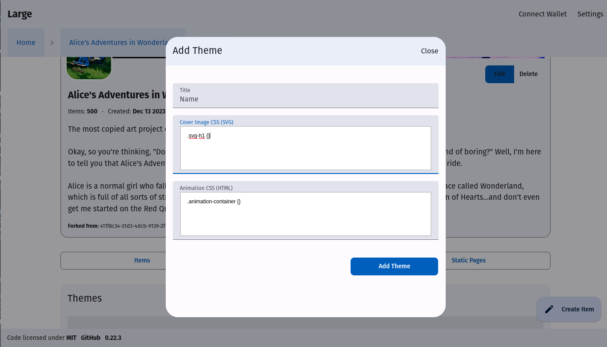

# Large NFT

An open source, decentralized, and offline-first CMS for Ethereum and IPFS.

[](https://www.npmjs.com/package/large-nft) [](https://www.javascript.com) [](https://github.com/Naereen/StrapDown.js/blob/master/LICENSE) 


## Installation 

### Clone
```console
git clone https://github.com/LargeNFT/large-nft.git
```

### Run a local HTTP Server
```console
npm install
npm run start
```

### Access in Browser
Large Admin will be available at [http://localhost:8000/large](http://localhost:8000/large) by default.


### Run a local dev Server
```console
npm run start:dev
```

### Access in Browser
Large Admin will be available at [http://localhost:9081/large](http://localhost:9081/large) by default.


Or [use a hosted version](https://golarge.app). Content is stored on user's local machine.


# Goal
Bring the permissionless properties of Ethereum to the rest of the NFT publishing stack.

* Publish content as a collection of Ethereum NFTs.
* Import, fork, and display existing ERC-721 collections with full transaction logs.
* Run on your own hardware or with popular cloud providers. 
* 100% open source JavaScript/TypeScript.


**Large NFT is alpha software and the API still changes frequently.**

### Community
Join us on [Discord](https://discord.gg/yJtjqHvqXm)

# Components

## Large Admin

* Create and publish NFT collections.
    * Include text, images, and mixed-media NFTs.
    * Generates NFT metadata.
* Fork existing ERC-721 collections.
* Data stored in local browser storage.
    * Publish to GitHub & GitLab for long-term storage and integration with Large Reader and IPFS.
* Deploy an ERC-721 gas-optimized smart contract to Ethereum.
    * Or use your own customized contract!
    * Set a mint price. Keep 100% of fees. 
* Reach customers on marketplaces like OpenSea, LooksRare, Blur, and X2Y2. 


### Create & Import


### Options include
* Create a new collection.
    * Create a brand new collection with new contect.
* Fork existing collection (from IPFS hash, contract, or hosted Large Reader)

### Create New Collection

* Choose a name, symbol, description.



* Choose language and configure:
    * Cover Image & Banner
        * Configure images to be displayed on Large Reader for collection.
    * Attributes
        * Add attributes to give specific items special properties (eg Type, Hat, Shirt, Necklace).
    * Mint & Contract Info
        * Set mint price and contract info.
    * Features & Licensing.
        * Add licensing information.
    * Configure Large Reader.
        * Configure production deployment details and set up marketplaces and external links like Twitter and Discord.



### Collection Overview

* Display cover image, banner, title, description, and a scrollable list of the items in the collection.
* Publish button.
* Edit/Delete buttons.
* Navigate to specific token by ID or by clicking on individual item.


### Create Item
* Each item has a title, content, and a cover image.
* If a cover image is not provided an SVG is generated from the text.
* Choose a theme for each item.
* Automatically generates HTML animation for display on marketplaces.


### SVG and HTML Themes
Apply custom CSS formatting to an NFT/item. Create themes and apply them to multiple items. 




* Enter name of theme.
* Enter CSS for created SVG and animation.
    * CSS inside .svg-h1 {} is applied to SVG.
    * CSS inside .animation-container {} is applied to generated HTML.


* Here is an example of a theme that applies a red border.


### Import/Fork Existing Collection

* From an IPFS hash
    * Collection must be one that was created with Large NFT.
* From Contract (requires connected wallet)
    * Download existing collection from a mainnet contract.
        * Note: Potentially limited by CORS restrictions depending on where collection's images are hosted.
* From Reader
    * Fork collection from an existing Large Reader website.
        * Note: This is potentially limited by CORS issues in the browser. Collection must be hosted on a server that does not trigger CORS warnings.


### Export collection metadata to IPFS.
* Connect to browser-based node or configure remote IPFS api.
* NFT metadata, images, animations, and backup data are exported to IPFS.

### Export to GitHub/GitLab
* Create a custom fork of the Large Reader.
* Use a personal access token to push content directly from your browser to GitHub and GitLab. 

### Deploy contract
* Deploy ERC-721 smart contract with minting capability to Ethereum mainnet or other compatible network.
* Customize smart contract or deploy the default low-gas contract.
    * Based on [ERC721A](https://github.com/chiru-labs/ERC721A)

---

## Large Reader 

* Generate a self-hosted PWA and deploy to any simple webhost.
    * Read, browse, and mint NFTs in the collection.
    * Optimized for text-based content and has functionality similar to an e-reader.
    * Full-featured PWA (Progressive Web App) with a native look and feel on modern devices.
* Combine with Large Sync to display the full transaction history.
* Uses PouchDB to enable offline searching, sorting, and filtering of content.


Generate a search-engine friendly static website for a collection. It is also a 

* Users do NOT need a web3 browser to read the collection.
* Users do NOT need a web3 browser to view transaction data. 
* Users DO need a web3 browser to mint and interact with NFTs.

### Offline-first.
* Easily distributed on any static webhost. 
* Wrap with Cordova to distribute to app stores.
* *Actual offline functionality via service worker will be available in a future release.

### Free and open source. Fork and customize.
* No lock-in. Use whatever tools you prefer.
* Publish to a public or private repo.

### Mint NFTs.
* Minting starts at token #1 and increments.
* Stories are minted in the order they are told.

### Optional smart contract.
* It's not required to deploy a contract if you do not want to mint NFTs.


The following commands are to be used in the forked repository that you publish from the Large Admin. After pushing the content to your git provider, clone the repo and run the following commands.

### Install
```console
npm install
```

### Config
Configuration for the generation and sync processes are stored in large-config.json.  

### Example
Here is an example configuration for a site hosted on GitLab Pages.

```json
{
    "hostname": "https://ptoner.gitlab.io",
    "baseURL": "/bladerunner-punks-reader/",

    "showMintPage": false,
    "showActivityPage": true,
    "marketplaces": [
        {
            "name": "OpenSea",
            "link": "https://opensea.io/collection/bladerunner-punks"
        },
        {
            "name": "LooksRare"
        }
    ],
    "externalLinks": [
        {
            "name": "Discord",
            "link": "https://discord.gg/NhuCN5s2Xa"
        },
        {
            "name": "Twitter",
            "link": "https://twitter.com/BladeRunnerPunk"
        }
    ],

    "headStart": "src/headStart.ejs", //Reference an ejs template you created at a relative path.
    "footer": "src/footer.ejs", //Reference an ejs template you created at a relative path

}
```


| Option | Default | Description | 
| ------------- | ------------- | ------------- |
| hostname  | http://localhost:8081 | The hostname where the generated Reader will be hosted. When generating the dev version it defaults to localhost. |
| baseURL  |  / | The path on the host where the generated app is hosted. This is used by the PWA's routing and must match the actual deployment URL. Must end with a /. For example /bladerunner-punks-reader/ 
| headStart  |   | Path to [ETA](https://eta.js.org/) template to insert at the beginning of the <head> tag on every page.
| logo  |   | Path to image to use in top left navigation in Reader for the home link.
| footer  |   | Path to [ETA](https://eta.js.org/) template to insert in footer on tag on every reader page.
| adminFooter  |   | Path to [ETA](https://eta.js.org/) template to insert in footer on tag on every page of the bundled copy of Large NFT.
| marketplaces  |   | See below
| externalLinks  |   | See below
| libraryURL  |   | The root url where the library will be deployed. Only used when run in library mode.
| largeURL  |   | Configure an external Large instance to link to instead of the built-in copy.
| env.dev.hostname  |  | Override the hostname when using the --env dev flag |
| env.dev.baseURL  |  | Override the baseURL when using the --env dev flag |
| env.dev.libraryURL  |  | Override the libraryURL when using the --env dev flag |
| env.dev.largeURL  |  | Override the largeURL when using the --env dev flag |


### Marketplaces
The marketplaces field is an array of objects, with each object representing a marketplace. The objects in the array should have the following fields:

**name:** a string representing the name of the marketplace. This field is required.

**link (optional):** a string representing the URL of the marketplace's homepage or collections page. This field is optional and does not need to be included in every object. If the name field matches a preconfigured value (such as "LooksRare"), the link field will be set to the corresponding URL.


In the example above, the link field for the "OpenSea" marketplace is the URL of the collection page for that marketplace. The link field for the "LooksRare" marketplace is not included. It will default to the preconfigured URL for the "LooksRare" marketplace.

You can add as many objects to the marketplaces array as you like, as long as each object has the required name field.

Currently OpenSea, Blur, and LooksRare are configured by default.

### External Links
Configure links to external resources associated with the collection such as Discord or Twitter. 


### Generate Large Reader for localhost
Note the -- before passing options. Generates HTML files in ./public folder.
```console
npm run generate:dev
```

### Generate Large Reader for localhost
```console
npm run start
```

### Access in Browser
The generated web app will be available at [http://localhost:8081](http://localhost:8081) by default.


### Generate Large Reader for production
Generates HTML files in 'public' branch.

```console
npm run generate
```

---

## Large Sync

* A lightweight Node app that generates live Ethereum transaction data for Large Reader in real-time or on a schedule.
    * Sales data for each token. 
    * Sales data for every user. 
    * A full collection leaderboard.
* The sync is designed to run both in the browser* and in Node.
* Supports <a href="https://www.alchemy.com/">Alchemy</a> and local Ethereum nodes.
* *Browser support coming later. Currently not practical.


* Full transaction history.
    * By token.
    * By wallet.
    * By attribute.
* Identify marketplace and aggregator sales on-chain.
    * Marketplaces
        * OpenSea (Wyvern)
        * OpenSea (Seaport)
        * LooksRare
        * X2Y2
        * Blur
    * Aggregators
        * Genie
* Pricing in ETH and USD.
    * Uses on-chain pricing from the Chainlink ETH/USD price feed.
    * No configuration needed.
* Aggregate reports for sales.
    * ETH sales (total + average)
    * USD sales (total + average)


Transaction data is cached and processed locally in SQLite and written to the ./public/sync folder. 

### Start Large Sync
Note the -- before passing options.
```console
npm run sync --  --env dev --alchemy <API key>
```

## API

| Option | Default | Description | 
| ------------- | ------------- | ------------- |
| --env  | production | This loads either the dev or production settings for hostname and baseURL. Also in dev mode nothing is written to the 'public' branch. |
| --channel-dir  | . | The root directory of the channel to sync/generate. |
| --alchemy  |   | Pass a valid API key to connect the sync process to an Alchemy hosted Ethereum node. 
| --sync-rate  | 30*1000  | Milliseconds between sync attempts. Default is 30 seconds. If set to zero the process will end once synchronized.
| --clear | false  | Set to "true" to clear all processed data and re-start sync from block 0. Does not delete downloaded data. To clear the database entirely delete the ./sync/data.sqlite file in your project folder. 

---


## Large Library

* Host multiple collections in the same app.
* Sync multiple collections.

The Large Library brings together multiple reader apps to work as a single library application.

The Library starts with an overview page that lists each collection in the library and an overview of the recent sales information.

[The NFT Commons](https://golarge.app/commons/) is an example of Large Library in production.

TODO: Show how to set up a library. 


### Start Large Library Sync

TODO: This command currently needs to be set up manually so this can't be run easily yet.

Note the -- before passing options.
```console
npm run sync-library --  --env dev --alchemy <API key>
```

## API

| Option | Default | Description | 
| ------------- | ------------- | ------------- |
| --env  | production | This loads either the dev or production settings for hostname and baseURL. Also in dev mode nothing is written to the 'public' branch. |
| --sync-dir  | . | The root directory of the channel to sync. |
| --alchemy  |   | Pass a valid API key to connect the sync process to an Alchemy hosted Ethereum node. 
| --sync-push-rate  | 30*1000  | Milliseconds between sync attempts. Default is 30 seconds. 
| --clear | false  | Set to "true" to clear all data and restart tracking the library. 

---


## Importer
Collections can be imported to a Large Library with the command-line import tool.

```console
npm run import -- --alchemy <API key> --contract <contract address>
```


## API

| Option | Default | Description | 
| ------------- | ------------- | ------------- |
| --env  | production | This loads either the dev or production settings for hostname and baseURL. |
| --fork-type  | "existing" | Options are "existing" and "fork". The fork option clears the existing contract information. |
| --contract  |   | Address of collection's Ethereum contract.
| --alchemy  |   | Pass a valid API key to connect the sync process to an Alchemy hosted Ethereum node. 

---

## Start Large Reader + Sync + Web Server

If you don't need to separate the generation and sync'ing components you can run the following commands to generate, start the sync, and run a simple static web server. All CLI arguments are passed to both the underlying "generate" and "sync" commands so all of the above parameters are supported. If you do not pass an Alchemy key the sync process will not start.

These commands are run in the Large Reader repo you created for your specific NFT collection.

Note the -- before passing options.
```console
npm run start -- --alchemy <API key>
```

To start with the dev (localhost) configuration use
```console
npm run start:dev -- --alchemy <API key>
```

The generated web app will be available at [http://localhost:8081](http://localhost:8081) by default.


# Goals

* Bring the permissionless properties of Ethereum to the rest of the NFT tech stack with a default viewer and marketplace that any user in the community can run.

* Make it easy for any user to host the digital infrastructure for an NFT collection to ensure owners can be self-reliant.

* What if an NFT creator disappears?
    * It's inevitable that every creator dies.
    * It's inevitable that every company dies.
    * The plan for technical implementation of the software stack should start with those assumptions. 
    * Decentralization demands it. 
    * Bitcoin continues to run even though Satoshi disappeared and so should an NFT collection.

* Free and open source code.
* Tools to build and launch an NFT collection.
    * Use the built-in contract or provide your own. (customization in future release)
* Tools to launch a fan experience for an existing NFT collection.
* Tools to launch a custom marketplace for any NFT collection. (future release)

* Create and publish NFTs.
    * Build an NFT collection from scratch.
    * Build a fan experience for an existing NFT collection.

* Share and remix existing ideas.
    * If you can't fork it it's not web3.

* Feel like an owner.
    * Empower users to experience feelings associated with ownership with their digital artifacts.
    * Help make sure users never lose the ability and rights to keep their digital property online for display and resale.

* A single member of the community should be able to keep things going themselves.
    * What happens to your digital collectibles if you're the last one who cares?
    * Are you able to keep them online? 
    * Are you able to rebuild the marketplace from scratch?
    * Do you have legal rights to display the content?
    * Permissionless ownership requires permisionless rights to display content.
    * As an artist do you want the value you built to crumble because no one is there to pay hosting fees?
    * Can you take your NFTs to space?

* What if OpenSea disappears? What if they change their terms? What if every market disappears?
    * Is it smart to have no backup plan if something drastic were to happen to the largest marketplace providers? A well-made collection should have a home base and it should (arguably) provide fee free trading just like the original Cryptopunks market.

* An NFT collection should have a default viewer, marketplace, and any user should be able to run it.
    * Otherwise we lose the permissionless and open source properties of Ethereum.

* If anyone can run the whole stack it has to be designed with similar constraints as Ethereum in the sense that a single user should be able to run the entire thing on a consumer-grade machine. 

* No dependency on app stores. Built for the open and free web. Large NFT and Large Reader are modern PWAs that run directly in the browser with a simple static webhost. Since it's built to work offline-first it can also be wrapped and distributed to app stores if you choose. 

* Distributed through web or IPFS. To be distributed through IPFS and the web the full stack must run in a web browser.

* Dependencies 
    * A web browser.
    * A simple static webhost.
        * If we want transaction data then add an Ethereum node + small device to run Large Sync.
    * A git provider (GitHub/GitLab).
    * IPFS node.


* Built with JavaScript so it can run in the browser and on any device.

* Provide reasonable defaults for new NFTs collection and the ability to change and customize.
    
* Any user can run the entire stack for a particular collection. 

* Provide a solid foundation for anyone to build on.


# Showcase
These project(s) showcase the basic features of the Large Reader. These projects are CC0 licensed and can be forked to start your own version of the project.
* [Alice's Adventures in Wonderland](https://readalice.com)


# Tests
Some tests. Needs more tests.
