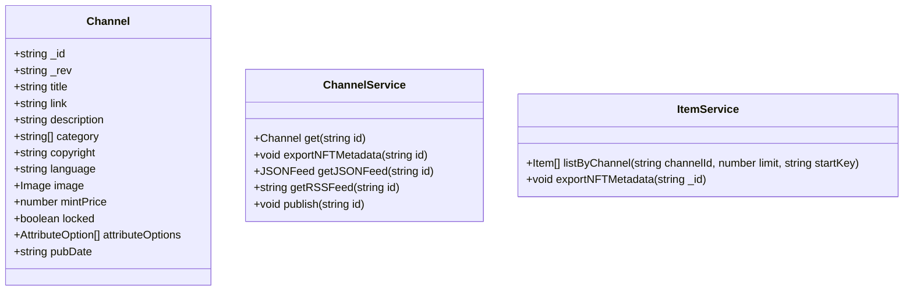

## Plan
* [x] Name the new issue like this: 'Story: \<who\> \<does what\> \<why>\'
* [x] Describe the objectives of the user story.
* [x] Create a written user journey. 
    * [x] Describe the interactions the user will take. 
    * [x] Describe what the user will see.
    * [x] Describe conditional situations.
* [x] Create visual wireframes if applicable. (upload attachment)
* [x] Create/edit UML diagrams with Mermaid.
* [x] Remove "Planning" label from issue and add "Planning Complete".

## Objectives
Allow the user to publish a blog and deploy it as an NFT collection.

## User Journey
* User begins on home page.
* User navigates to specific blog.
* If user is author of the blog they see a "Publish" button.
* Clicking the publish button opens a confirmation dialog.

* Export the blog RSS feed and save it.
* Export the blog IPFS directory and save it. 
  * Upload to Pinata. 

* Open MetaMask.
* User confirms transaction and pays gas.

## UML Diagram(s)

