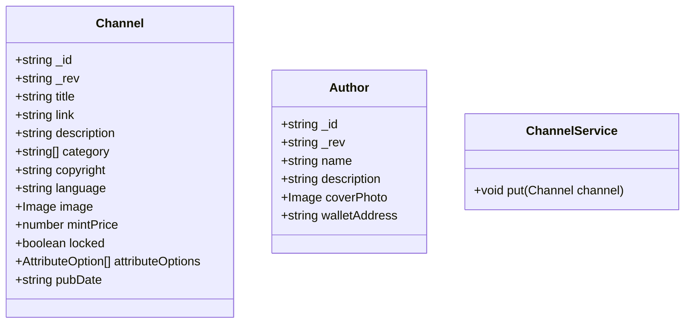

## Plan
* [x] Name the new issue like this: 'Story: \<who\> \<does what\> \<why>\'
* [x] Describe the objectives of the user story.
* [x] Create a written user journey. 
    * [x] Describe the interactions the user will take. 
    * [x] Describe what the user will see.
    * [x] Describe conditional situations.
* [x] Create visual wireframes if applicable. (upload attachment)
* [x] Create/edit UML diagrams with Mermaid.
* [x] Remove "Planning" label from issue and add "Planning Complete".

## Objectives
As a blog owner I can update the title, description, photo, and mint price of an unlocked blog.

## User Journey
* User starts on admin home page.
* User views blog they want to edit. 
* User clicks on title and the "Edit Blog" page pops opens.
* If the blog is locked display a message telling the user they can't update the blog.
* If the blog is unlocked display a form to edit:
    * Author name - Required
    * Author URL - Required

    * Title - Required 
    * Description - Optional
    * Category - Required
    * Copyright - Optional
    * Language - Optional

    * Preview Photo - Optional
      * User can click the file upload button to choose a new photo

    * Attributes
      * User can type a list of attribute categories and hit enter to add it. 
      * User can type a list of attributes for each category and hit enter to add each one.
      * User can delete a tag and it will remove from existing posts.      

    * Mint price (ETH)

## UML Diagram(s)

