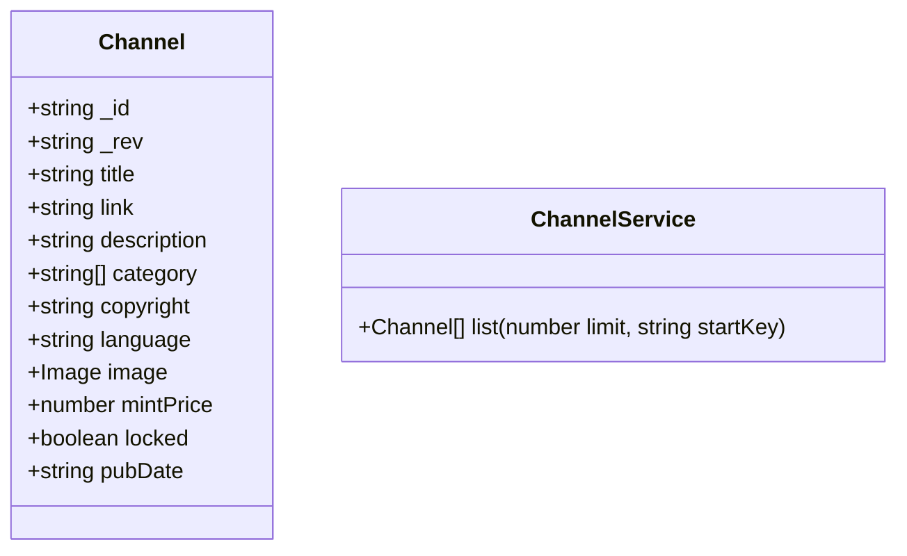

## Plan
* [x] Name the new issue like this: 'Story: \<who\> \<does what\> \<why>\'
* [ ] Describe the objectives of the user story.
* [ ] Create a written user journey. 
    * [ ] Describe the interactions the user will take. 
    * [ ] Describe what the user will see.
    * [ ] Describe conditional situations.
* [ ] Create visual wireframes if applicable. (upload attachment)
* [ ] Create/edit UML diagrams with Mermaid.
* [ ] Remove "Planning" label from issue and add "Planning Complete".

## Objectives
The home screen of the admin panel displays a list of blogs the user has created. 

## User Journey
* User sees a list of blogs they have created. 
* Each one shows a 
  * Name. 
    * The name is a link to the collection.
  * Description.
  * Category.
  * Author name.
  * Preview photo.
  * Wallet address.
  * Whether it is locked or unlocked for new posts.

## UML Diagram(s)

