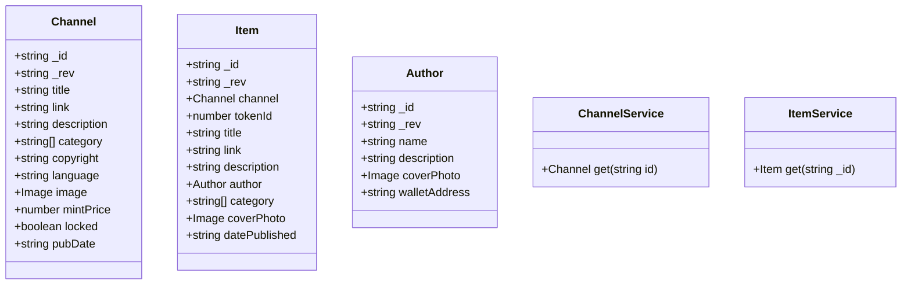

## Plan
* [ ] Name the new issue like this: 'Story: \<who\> \<does what\> \<why>\'
* [ ] Describe the objectives of the user story.
* [ ] Create a written user journey. 
    * [ ] Describe the interactions the user will take. 
    * [ ] Describe what the user will see.
    * [ ] Describe conditional situations.
* [ ] Create visual wireframes if applicable. (upload attachment)
* [ ] Create/edit UML diagrams with Mermaid.
* [ ] Remove "Planning" label from issue and add "Planning Complete".

## Objectives
As a user I can view an individual blog post.

## User Journey
* User begins on admin home.
* User clicks on link to view existing blog and navigates to existing post.
* View post page opens.

* If user is the author of the post and it is not published display an "Edit" and "Delete" buttons.

* User sees:
  * Title
  * By author
  * Category
  * Date Published
  * Cover photo
  * Description
  * List of attributes

* If post can be minted as an NFT display the price and a mint button.
* If NFT is owned display current owner.

## UML Diagram(s)

