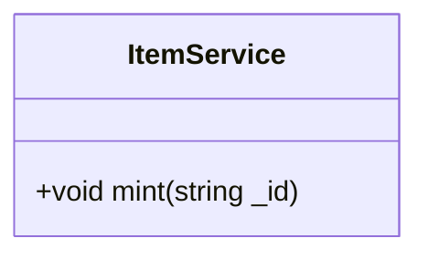

## Plan
* [ ] Name the new issue like this: 'Story: \<who\> \<does what\> \<why>\'
* [ ] Describe the objectives of the user story.
* [ ] Create a written user journey. 
    * [ ] Describe the interactions the user will take. 
    * [ ] Describe what the user will see.
    * [ ] Describe conditional situations.
* [ ] Create visual wireframes if applicable. (upload attachment)
* [ ] Create/edit UML diagrams with Mermaid.
* [ ] Remove "Planning" label from issue and add "Planning Complete".

## Objectives
As a user I can mint an individual post as an NFT.

## User Journey
* User navigates to individual blog post.
* User clicks on "Mint" button.
* MetaMask opens and asks the user to submit a transaction. 
* User approves transaction.
* Transaction is mined by Ethereum network.
* User is now owner of NFT. 

## UML Diagram(s)

