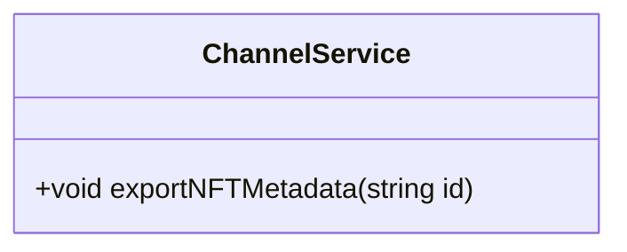

## Plan
* [x] Name the new issue like this: 'Story: \<who\> \<does what\> \<why>\'
* [x] Describe the objectives of the user story.
* [x] Create a written user journey. 
    * [x] Describe the interactions the user will take. 
    * [x] Describe what the user will see.
    * [x] Describe conditional situations.
* [x] Create visual wireframes if applicable. (upload attachment)
* [x] Create/edit UML diagrams with Mermaid.
* [x] Remove "Planning" label from issue and add "Planning Complete".

## Objectives
As a user I can view a published blog post on OpenSea. The blog author will need to set the collection up on OpenSea or possibly we can automate it.

When a blog is published we export the NFT metadata to IPFS.

## User Journey
* User starts on admin home page.
* User clicks on published blog.
* User clicks on link to OpenSea collection.
* User sees collection name, description, cover photo and list of posts as NFTs.

## UML Diagram(s)

