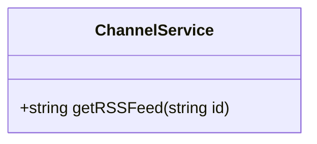

## Plan
* [x] Name the new issue like this: 'Story: \<who\> \<does what\> \<why>\'
* [x] Describe the objectives of the user story.
* [x] Create a written user journey. 
    * [x] Describe the interactions the user will take. 
    * [x] Describe what the user will see.
    * [x] Describe conditional situations.
* [x] Create visual wireframes if applicable. (upload attachment)
* [x] Create/edit UML diagrams with Mermaid.
* [x] Remove "Planning" label from issue and add "Planning Complete".

## Objectives
As a user I can view a published blog's RSS XML feed.

## User Journey
* User starts on admin home page.
* User clicks on published blog.
* User clicks on RSS link
* User views RSS feed for blog via IPFS link.

## UML Diagram(s)

