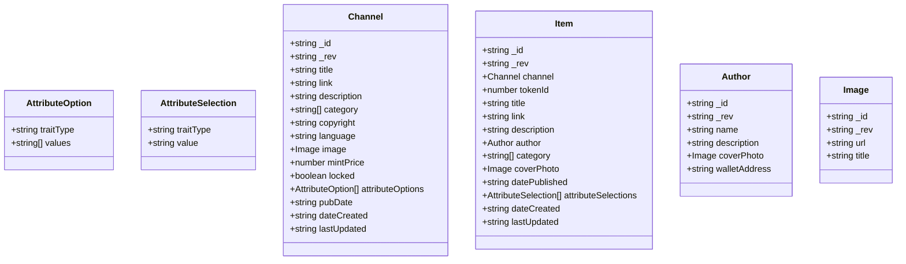
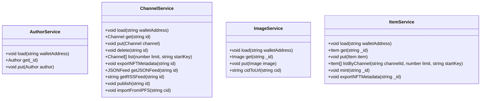

```mermaid
classDiagram

class AttributeOption
AttributeOption : +string traitType
AttributeOption : +string[] values

class AttributeSelection
AttributeSelection : +string traitType
AttributeSelection : +string value 

class Channel

Channel : +string _id 
Channel : +string _rev 

Channel : +string title
Channel : +string link
Channel : +string description

Channel : +string[] category
Channel : +string copyright
Channel : +string language

Channel : +Image image

Channel : +number mintPrice
Channel : +boolean locked

Channel : +AttributeOption[] attributeOptions

Channel : +string pubDate

Channel : +string dateCreated
Channel : +string lastUpdated


class Item
Item : +string _id 
Item : +string _rev 

Item : +Channel channel
Item : +number tokenId

Item : +string title
Item : +string link
Item : +string description
Item : +Author author
Item : +string[] category
Item : +Image coverPhoto
Item : +string datePublished

Item : +AttributeSelection[] attributeSelections

Item : +string dateCreated
Item : +string lastUpdated

class Author
Author : +string _id 
Author : +string _rev 

Author : +string name
Author : +string description
Author : +Image coverPhoto
Author : +string walletAddress

class Image
Image : +string _id
Image : +string _rev

Image : +string url
Image : +string title

```

```mermaid
classDiagram

class AuthorService
AuthorService : +void load(string walletAddress)
AuthorService : +Author get(_id)
AuthorService : +void put(Author author)


class ChannelService
ChannelService : +void load(string walletAddress)
ChannelService : +Channel get(string id)
ChannelService : +void put(Channel channel)
ChannelService : +void delete(string id)

ChannelService : +Channel[] list(number limit, string startKey)

ChannelService : +void exportNFTMetadata(string id)

ChannelService : +JSONFeed getJSONFeed(string id)
ChannelService : +string getRSSFeed(string id)
ChannelService : +void publish(string id)
ChannelService : +void importFromIPFS(string cid)

class ImageService
ImageService : +void load(string walletAddress)
ImageService : +Image get(string _id)
ImageService : +void put(Image image)
ImageService : +string cidToUrl(string cid)

class ItemService
ItemService : +void load(string walletAddress)
ItemService : +Item get(string _id)
ItemService : +void put(Item item)
ItemService : +Item[] listByChannel(string channelId, number limit, string startKey)
ItemService : +void mint(string _id)

ItemService : +void exportNFTMetadata(string _id)
```